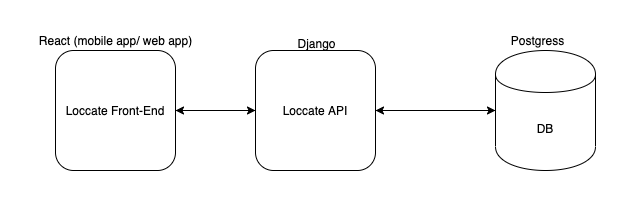

## Loccate API
This is the backend for loccate

## Architecture

### Installation
 - Have docker installed 
 - clone this repository `git clone https://github.com/urandu/loccate.git`
 - `cd loccate`
 - `docker-compose up`
 - `docker-compose run api python manage.py createsuperuser`
 - `docker-compose run api python manage.py makemigrations`
 - `docker-compose run api python manage.py migrate`

### API swagger documentation

- Swagger API doc located at http://localhost:8900/swagger

#### TODO
 - Add authentication
 
